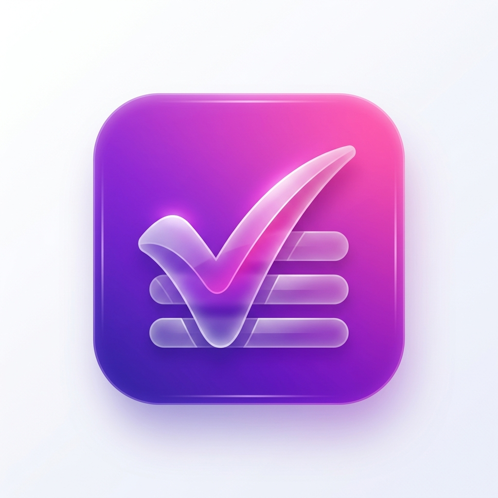

# TaskFlow



A sleek, premium, and highly responsive Task Management (TODO) application built with Flutter. 
TaskFlow is designed with modern aesthetics (glassmorphism, gradients, smooth animations) to help you organize your life effortlessly.

## ✨ Features
- **Local Persistence**: Tasks are securely saved to your local device using `shared_preferences`.
- **Advanced Task Management**: Categorize your tasks (Work, Personal, Shopping, etc.) and assign due dates.
- **Dynamic Filtering**: Quickly filter tasks by All, Active, or Completed status.
- **Modern UI/UX**: Enjoy smooth staggered animations, custom bottom sheets, swipe-to-delete, and a beautiful Animated Splash Screen.
- **Adaptive Theming**: Full support for both Light and Dark modes.

## 🚀 Getting Started

### Prerequisites
- Flutter SDK (latest version recommended)
- Android Studio / Xcode (for mobile deployment)
- Chrome (for web deployment)

### Installation
1. Clone the repository:
   ```bash
   git clone https://github.com/tejaspatel2255/To-Do-app.git
   ```
2. Navigate to the project directory:
   ```bash
   cd To-Do-app
   ```
3. Get the dependencies:
   ```bash
   flutter pub get
   ```
4. Run the app:
   ```bash
   flutter run
   ```

## 🛠 Tech Stack
- **Framework**: Flutter
- **State Management**: Provider
- **Storage**: Shared Preferences
- **Styling**: Google Fonts, Flutter Animate

---
*Developed with Flutter.*
